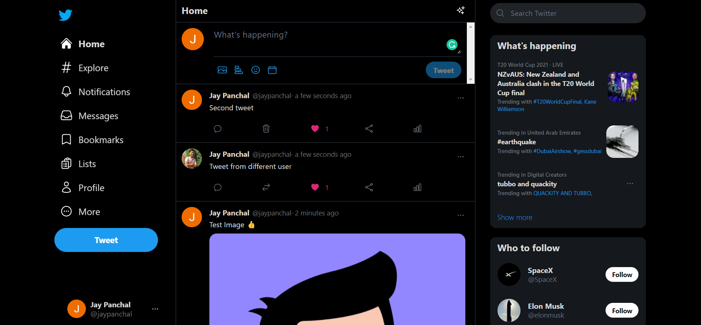

# BirdApp

The Bird app is a Twitter clone created using React and Tailwind CSS. From this project, I got to learn about React useeffects, fetch, components, routers, and useRef, as well as the Firebase database.

# Demo:

### Emoji 

### Image upload

### Dashboard 

### multiple user 

### Responsive

